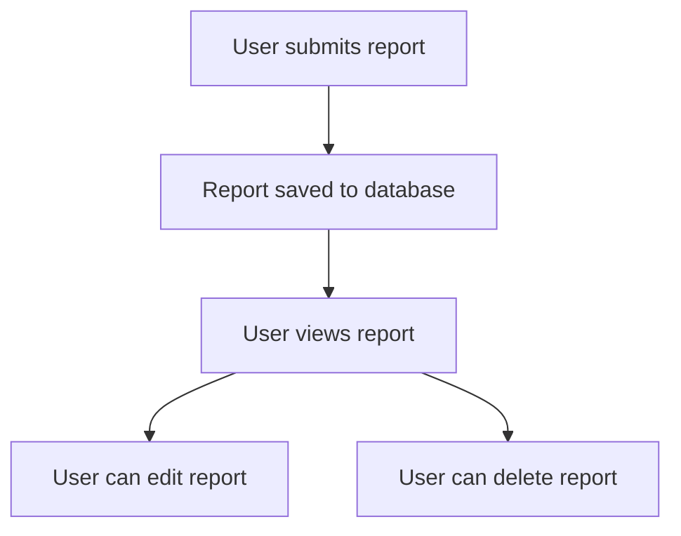
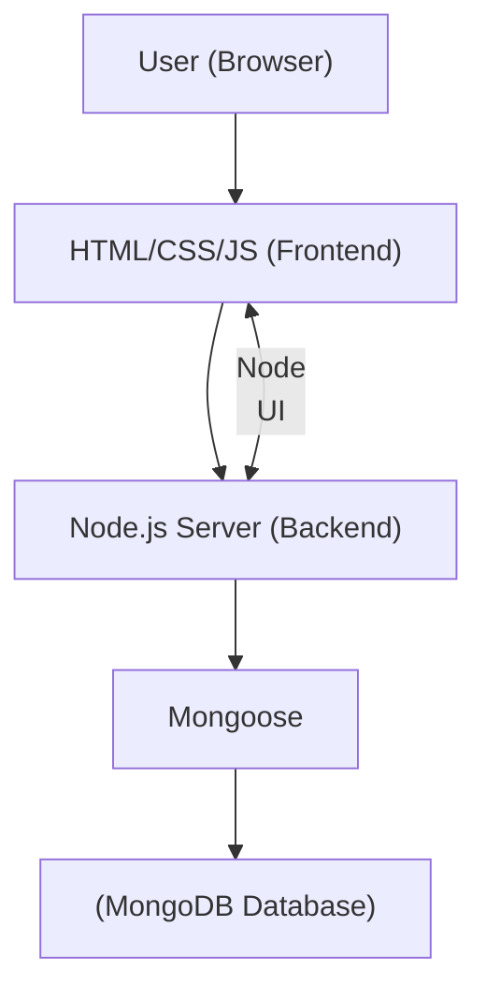

## Conceptual and Architecture Overview

This document provides a visual overview of **CommunityVoice**, including how users interact with the system and how the main components are structured.

## Conceptual Diagram

Below is a diagram illustrating how users submit, view, edit, and delete reports within **CommunityVoice**.

## Architecture Diagram

This diagram shows the main technical components and data flow in the **CommunityVoice** system.

---

**Note:** For a complete description of **CommunityVoice** and its features, return to the [Main README](README.md).
